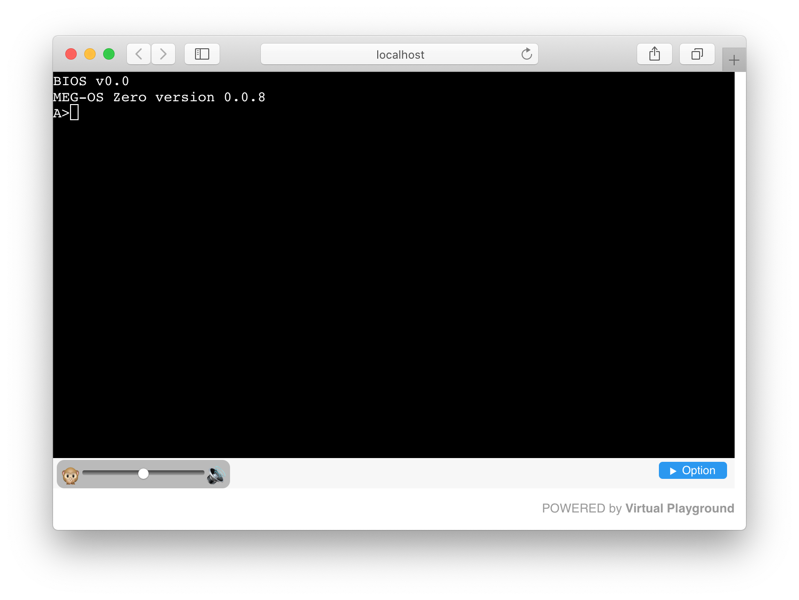

# Virtual Playground

A PC Emulator implemented by WebAssembly.

- [Preview website](https://nerry.jp/vpc/)
- [Repository](https://github.com/neri/vpc)

## THIS VERSION

- THIS IS JUNK

## Implemented hardware

- CPU: 486SX?
  - Some features are missing such as 16bit protected mode
- Memory: 640KB ought to be enough for anybody.
- I/O:
  - i8259 PIC
  - i8254 Timer & Sound
  - UART
  - RTC
  - FDC (non standard interface)
    - Supported: 160KB, 360KB, 640KB, 720KB, 1.2MB, 1.4MB and 512 bytes (Boot Sector Only)

## Supported OS

|OS|Status|
|-|-|
|osz|It seems ok|
|FreeDOS|failed|
|elks|failed|
|BootChess|buggy|

## License

MIT License

Copyright (C)2019 Nerry
