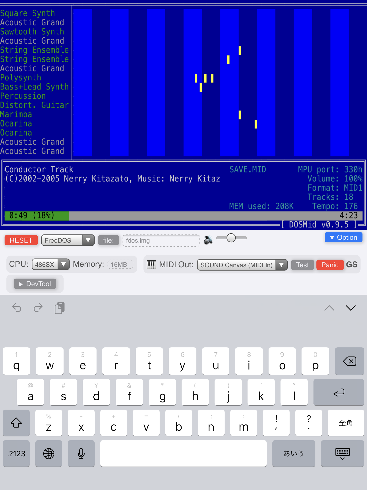

# Virtual Playground

A PC Emulator implemented by WebAssembly.

- [Preview website](https://nerry.jp/vpc/)
- [Repository](https://github.com/neri/vpc)

## THIS VERSION

- THIS IS JUNK

## Requirements

- [WebAssembly](https://caniuse.com/#feat=wasm)

## Implemented hardware

- IBM PC compatible
- CPU: 486SX
- Memory: 640KB ought to be enough for anybody.
- I/O:
  - **i8259** PIC
  - **i8254** Timer & Sound
  - **UART**
  - **RTC**
  - **MPU-401** - UART mode Only
  - **VGA** - mode 03 and 13 only
  - **FDC** (non standard interface)
    - Supported: 160KB, 360KB, 640KB, 720KB, 1.2MB, 1.4MB and 512 bytes (Boot Sector Only)

|Feature|Status|
|-|-|
|Real Mode| :ok: |
|A20|Always ON|
|FPU / MMX / SSE| - |
|Protected Mode| :ok: |
|Segmentation| Partially |
|Segment Limit| Partially |
|TSS|32bit Only|
|LDT| :ok: |
|Task Gate| - |
|Interrupt / Trap Gate|32bit Only|
|Call Gate| - |
|Virtual 8086 Mode| WIP |
|Paging| - |

### How to detect this software in the virtual machine

- In 486 mode, when the CPUID instruction is executed with EAX = 00000000, the result will be EBX = ECX = EDX = 0x4D534157 ('WASM')
- Otherwise, undefined.

## Supported Software

|Software|Status|
|-|-|
|osz|It seems working|
|FreeDOS (kernel)|It seems working|
|elks|failed|
|haribote OS|buggy|
|BootChess|buggy|
|[Floppy Bird](https://github.com/icebreaker/floppybird)|Needs a [patch](https://github.com/neri/floppybird/commit/6db932489afd6bbb5bddcdf0185d9f9051914459)|
|[Invaders game in 512 bytes](https://github.com/nanochess/Invaders)|It seems working|

## License

MIT License

Copyright (C)2019 Nerry
